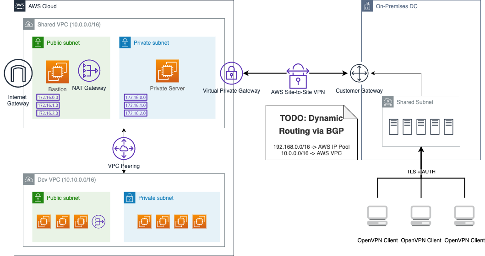

# terraform-vpc-network




## Usage

```
$ make
Usage: make [command] [args]
        apply-vpc            Apply an execution plan for vpc  (e.g. make apply-vpc dev)
        apply-vpn            Apply an execution plan for vpn  (e.g. make apply-vpb dev)
        apply                Apply project                  (e.g. make apply {env})
        check-scripts        Check scripts                  (e.g. make check-scripts)
        clean                Clean terraform                (e.g. make clean)
        destroy              Destroy project                (e.g. make apply {env})
        get-tools            Install tools for development  (e.g. make get-tools)
        help                 Show this help message         (e.g. make help)
        init                 Initialize project             (e.g. make init {env})
        plan-vpc             Generates an execution plan for vpc  (e.g. make plan-vpc dev)
        plan-vpn             Generates an execution plan for vpn  (e.g. make plan-vpn dev)
        plan                 Plan project                   (e.g. make plan {env})
        show-azs             List availability zones from current region (e.g. make show-azs)
```

## Input

(TBD)

## Output

(TBD)
